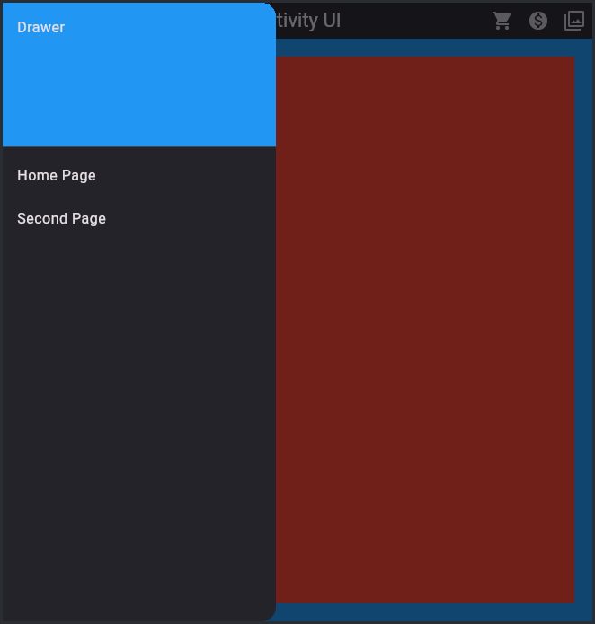
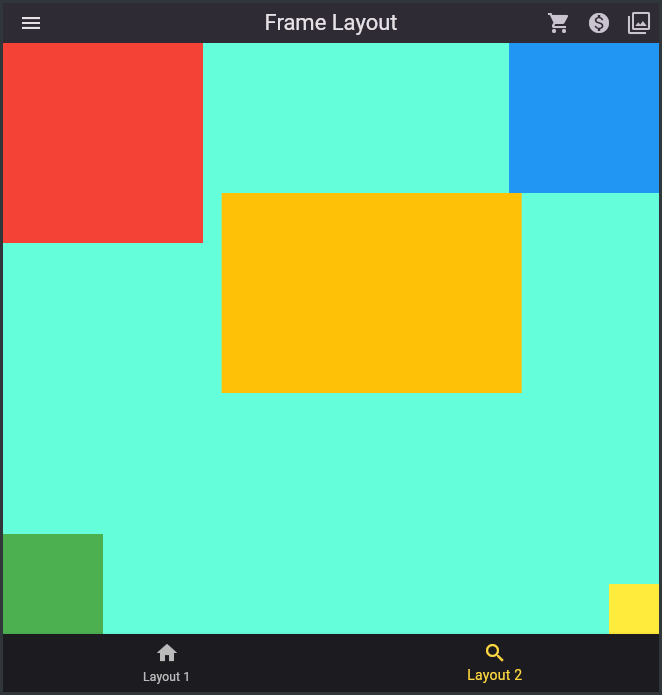
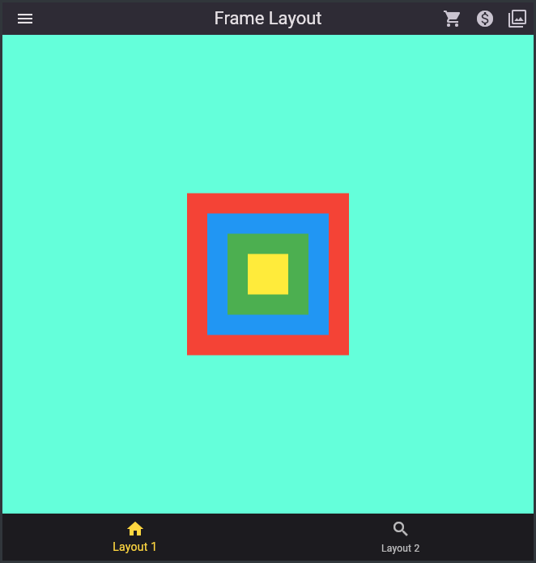

En este proyecto se desarrolla una interfaz creada en flutter con utilizando widgets como AppBar, BottomNavigationBar y Drawer o menú desplegable en ambos lados de la interfaz.

Tomado de:

https://burhanrashid52.medium.com/flutter-for-android-developers-how-to-design-activity-ui-in-flutter-4bf7b0de1e48

https://medium.com/flutter-community/flutter-for-android-developers-how-to-design-framelayout-in-flutter-93a19fc7e7a6

Adaptado y modificado por AOCTAVIOPB
